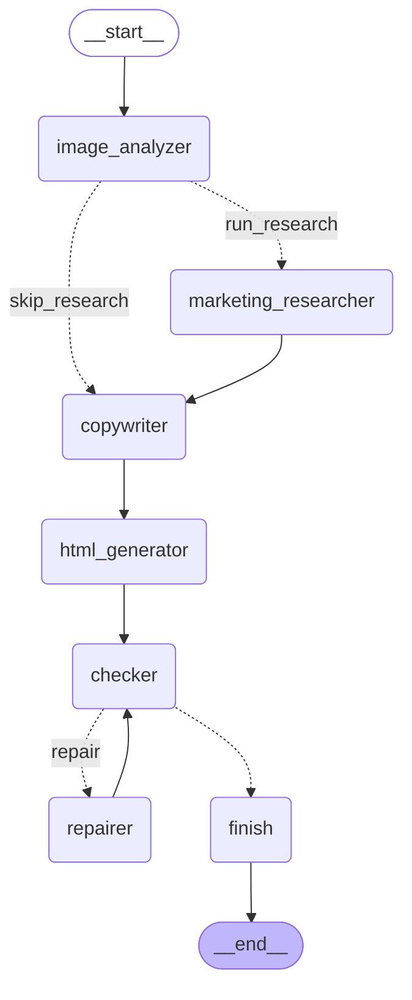

# PageFly

PageFly turns a product's name, price and images into a single-file HTML landing page. A LangGraph workflow passes the product through a chain of LLM agents: image analysis, Marketing Angle research, copywriting and HTML generation. A check step then validates the page, and a repair agent fixes it once if the check fails. A FastAPI service runs the graph and serves the generated pages.

This repository is the backend only.

## Hackathon origin

PageFly was built in 24 hours (18–19 April 2025) at Maystro Delivery's internal Agentic AI Hackathon to showcase agentic AI. The team of four placed 2nd.

The `hackathon-2025-04-19` tag marks the 24-hour version. The repair agent, the check step, the tests, the provider configuration and the cleanup were added after the hackathon.

## Team

- **Chamel Nadir Bouacha**: designed the LangGraph workflow and built the agents (image analysis, Marketing Angle research with Tavily, copywriting, HTML generation).
- **Feninekh Chaima**: built the FastAPI endpoints and the Shopify scraper.
- **Yasser Djamel Eddine Khelil**: built the frontend, which is not in this repository.

## How it works

The graph is built by `create_graph` in `workflow/graph.py`. This diagram is generated from it:



- **image_analyzer** describes each product image with the vision-capable chat model.
- **marketing_researcher** runs only when the request has no Marketing Angle. It searches the web with Tavily and returns a recommended angle.
- **copywriter** writes the copy for each section of the layout.
- **html_generator** turns the layout, copy and product images (with their descriptions as alt text) into one HTML file.
- **checker** verifies that the HTML parses, that every layout section has an element with the section's id, that every `` has alt text, and that at least one product image appears as an `` when the request has images.
- **repairer** gets the page and the check's problem list and returns a fixed page. It runs at most once; the page is then checked again.
- **finish** fails the run if problems remain.

A node that fails writes `error_message`, and the nodes after it skip their work.

## Setup

Install [uv](https://docs.astral.sh/uv/), then from the repository root:

```shell
uv sync --all-extras --dev
```

### Environment variables

Copy `.env.example` to `.env` and fill in the keys.

| Variable | Default | Purpose |
|---|---|---|
| `LLM_API_KEY` | none | API key for the OpenAI-compatible provider |
| `LLM_BASE_URL` | `https://openrouter.ai/api/v1` | Provider endpoint |
| `LLM_MODEL` | `deepseek/deepseek-v4.1-flash` | Chat model; it must accept image input and tool calls |
| `LLM_MAX_TOKENS` | `8192` | Maximum completion tokens per call |
| `TAVILY_API_KEY` | none | Web search for Marketing Angle research; needed only when no angle is given |
| `CORS_ORIGINS` | `http://localhost:3000,http://localhost:5173` | Comma-separated origins allowed to call the API |

## Running the API

```shell
uv run --env-file .env uvicorn api.main:app
```

The API does not read `.env` by itself, so pass it with `--env-file`. The app starts without API keys; the graph is built on the first generation request.

```shell
curl http://127.0.0.1:8000/
```

returns `{"Hello":"World"}`.

Endpoints:

- `POST /generate` takes the product (`product_name`, `product_price`, `currency` of `DZD`, `EUR` or `USD`, 1 to 6 `images` URLs), optional `marketing_angle`, `language` (default `ar`) and the section switches `is_hero`, `is_feature`, `is_testimonials`, `is_pricing`, `is_contact`, `is_footer`. It runs the graph and returns `{"preview_url": "/preview/<key>"}`, or 502 with the error when the graph fails.
- `POST /scrape-shopify` takes a Shopify product `url` and an optional `marketing_angle`, scrapes the product, then generates a page with all sections enabled.
- `GET /preview/{key}` serves a generated page.

## Smoke run

`scripts/smoke_run.py` runs the real graph once on a sample product, writes the page to `out/smoke_page.html` and prints the route, check result, repair passes, token usage and the provider-reported cost summed over all model calls (`cost: not reported` when the provider sends none). It makes paid API calls and reads `.env` itself.

```shell
uv run python scripts/smoke_run.py --help
```

Pass `--angle "<text>"` to skip research, so no `TAVILY_API_KEY` is needed. Pass `--language <code>` (default `en`) to set the copy language.

A recorded run on 2026-10-08 with `deepseek/deepseek-v4.1-flash` through OpenRouter took the research route, passed the check with 0 repair passes and used 31,159 tokens (about $0.014 at list price). The page showed the product image with alt text taken from the image analysis.

## Tests and lint

The tests run offline with a scripted fake chat model and a fake search tool; they need no API keys.

```shell
uv run pytest
uv run ruff check .
uv run ruff format --check .
```

## Known limits

- Generated pages live in an in-memory dict and are lost when the server stops.
- Generation is synchronous: a request waits for the whole graph, about a minute.
- The Shopify scraper reads Shopify's public product JSON (`<product url>.json`) and takes the currency from the page's `og:price:currency` tag (USD when the tag is missing). When the JSON is unavailable it falls back to HTML selectors that fit only a few Shopify themes. Stores that disable the JSON endpoint and use other themes return 422.
- The frontend is not in this repository.
- The check step is structural only (section ids, alt text, product image present, parsing). It does not judge copy or design quality.
- "Parses" means the page has an `<html>` element: Python's HTML parser accepts almost any input.
