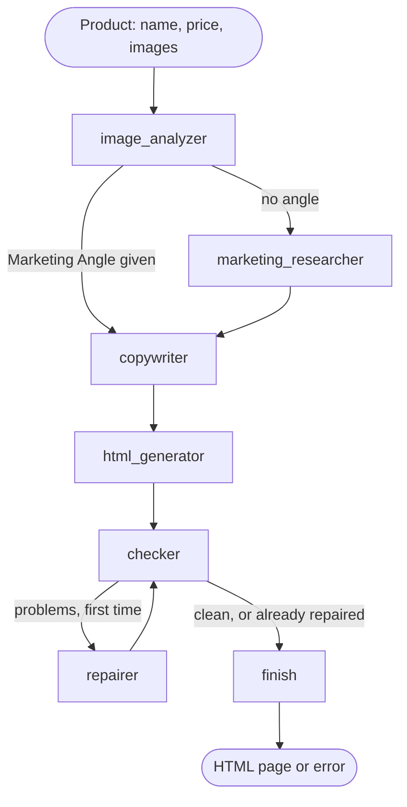

# PageFly

**Product photos in, a finished landing page out.** PageFly is a multi-agent system that turns a product's name, price and images into a single-file HTML landing page, with the copy written in the shop's own language, Arabic and right to left included.

[](https://github.com/Chamiln17/pagefly/actions/workflows/ci.yml)
[](LICENSE)


_A real page, generated in Arabic by one recorded run that cost $0.0032 ([details](#results))._

**2nd place** at Maystro Delivery's internal Agentic AI Hackathon (24 hours, April 2025, team of four). After the hackathon, the prototype was rebuilt into a tested, CI-checked and open-sourced project.

## Highlights

- **Five LLM agents in a LangGraph workflow.** Image analysis, Marketing Angle research, copywriting, HTML generation and repair, each with one job.
- **Research only when it is needed.** If the request carries a Marketing Angle, the graph skips web research; otherwise an agent searches the web (Tavily) and derives one.
- **Self-checking output.** A deterministic check step verifies every page: structure, alt text, and that the product image is shown. When it fails, a repair agent gets one pass to fix the page, and the check runs again.
- **Cheap to run, with measured costs.** Any OpenAI-compatible provider works. With DeepSeek through OpenRouter, a full page costs about a third to three quarters of a US cent per run, measured from the provider's bill.
- **Tested without spending money.** 63 tests run offline against scripted fake models and a fake search tool, so no test needs an API key or network access.
- **Guarded CI.** Every push runs tests, ruff, mypy, a lock-file check, a gitleaks secret scan over the full history, and a pip-audit dependency audit.

## How it works



| Step | What it does |
|---|---|
| `image_analyzer` | Describes each product image with a vision-capable model. The descriptions feed the copy and become the pages' alt text. |
| `marketing_researcher` | Runs only without a Marketing Angle: searches the web with Tavily and recommends one. |
| `copywriter` | Writes the copy for every section of the layout, in the requested language, around the price and the angle. |
| `html_generator` | Builds one self-contained HTML file from the layout, the copy and the product images. |
| `checker` | No LLM. Checks that the page is one HTML document, every layout section exists, every image has alt text, and a product image is shown. |
| `repairer` | Gets the page and the problem list and returns a fixed page. Runs at most once. |
| `finish` | Fails the run if problems remain, so the API never serves a broken page. |

A step that fails records the error, and the steps after it skip their work. The API turns that error into an HTTP 502 response.

## Quick start

Requires [uv](https://docs.astral.sh/uv/).

```shell
git clone https://github.com/Chamiln17/pagefly.git
cd pagefly
uv sync --all-extras --dev
cp .env.example .env        # then add LLM_API_KEY (and TAVILY_API_KEY for research)
uv run --env-file .env uvicorn api.main:app
```

Generate a page (this calls the paid model API):

```shell
curl -X POST http://127.0.0.1:8000/generate \
  -H "Content-Type: application/json" \
  -d '{
        "product_name": "Ceramic Coffee Mug",
        "product_price": 2500,
        "currency": "DZD",
        "images": ["https://upload.wikimedia.org/wikipedia/commons/4/45/A_small_cup_of_coffee.JPG"],
        "marketing_angle": "Café-style coffee rituals at home",
        "language": "ar",
        "is_hero": true, "is_feature": true, "is_pricing": true
      }'
```

The response is `{"preview_url": "/preview/<key>"}`. Open it at `http://127.0.0.1:8000/preview/<key>`.

### API

| Endpoint | Purpose |
|---|---|
| `POST /generate` | Product name, price, currency (`DZD`, `EUR` or `USD`), 1 to 6 image URLs, optional Marketing Angle, `language` (default `ar`) and section switches (`is_hero`, `is_feature`, `is_testimonials`, `is_pricing`, `is_contact`, `is_footer`). Returns the preview URL, or 502 when generation fails. |
| `POST /scrape-shopify` | A Shopify product URL and an optional Marketing Angle. Reads the product from the store, then generates a page with every section. Returns 422 for unsupported products or non-public URLs. |
| `GET /preview/{key}` | Serves a generated page. |

### Configuration

| Variable | Default | Purpose |
|---|---|---|
| `LLM_API_KEY` | none | Key for the OpenAI-compatible provider |
| `LLM_BASE_URL` | `https://openrouter.ai/api/v1` | Provider endpoint |
| `LLM_MODEL` | `deepseek/deepseek-v4.1-flash` | Must accept image input and tool calls |
| `LLM_MAX_TOKENS` | `8192` | Maximum completion tokens per call |
| `TAVILY_API_KEY` | none | Web search; needed only when no Marketing Angle is given |
| `CORS_ORIGINS` | `http://localhost:3000,http://localhost:5173` | Origins allowed to call the API |

## Results

Recorded runs on 2026-10-08 with `deepseek/deepseek-v4.1-flash` through OpenRouter. Costs are what the provider billed.

| Run | Result | Tokens | Cost |
|---|---|---|---|
| English, with web research | check passed first time, product image shown | 31,159 | $0.0078 |
| Arabic, with a Marketing Angle | check passed first time; the screenshot above | 11,251 | $0.0032 |
| Repair demo: a page with a missing section and a missing alt text | both problems fixed in one call, check passed | 461 | $0.00008 |

Reproduce them with the smoke script, which prints the route, check result, repair passes, tokens and billed cost:

```shell
uv run python -m scripts.smoke_run --help
uv run python -m scripts.smoke_run --language ar --angle "…" --screenshot
uv run python -m scripts.smoke_run --repair-demo
```

## Development

```shell
uv run pytest               # offline, no keys
uv run ruff check . && uv run ruff format --check .
uv run mypy .
```

```text
agents/     one module per LLM agent
workflow/   the LangGraph graph and the deterministic check
core/       shared state, model factory, HTML extraction
api/        FastAPI app, routes and the Shopify scraper
scripts/    smoke run and headless screenshots
tests/      offline tests with fake models
```

See [CONTRIBUTING.md](CONTRIBUTING.md) for the workflow and [CODING_STANDARDS.md](CODING_STANDARDS.md) for review rules.

## Origin

PageFly was built in 24 hours (18–19 April 2025) at Maystro Delivery's internal Agentic AI Hackathon, where it placed 2nd. The `hackathon-2025-04-19` tag marks that version. These came later:

- the check step and the repair agent
- an API that runs the full agent graph
- provider configuration and measured costs
- the offline test suite and CI
- a Shopify scraper that works on any store with a public product page
- a security pass: SSRF protection, dependency upgrades, secret scanning

## Team

- **Chamel Nadir Bouacha**: designed the LangGraph workflow and built the agents; led the post-hackathon rebuild.
- **Feninekh Chaima**: built the FastAPI endpoints and the Shopify scraper.
- **Yasser Djamel Eddine Khelil**: built the frontend, which lives outside this repository.

## Known limits

- Generated pages are kept in memory and lost when the server stops.
- Generation is synchronous: a request waits for the whole graph, about a minute.
- The check step tests structure, not copy or design quality.
- The Shopify scraper falls back to HTML selectors that fit only a few themes when a store hides its product JSON.
- The API has no authentication or rate limiting, and every generation calls paid APIs. Read [SECURITY.md](SECURITY.md) before deploying it anywhere public.

## License

[MIT](LICENSE). Report security problems privately as described in [SECURITY.md](SECURITY.md).
